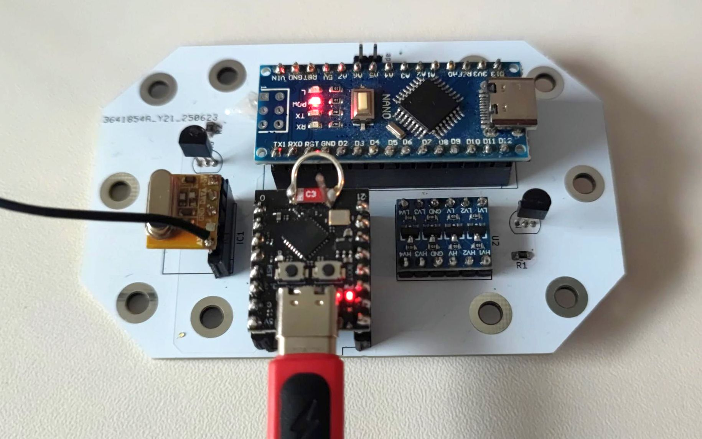
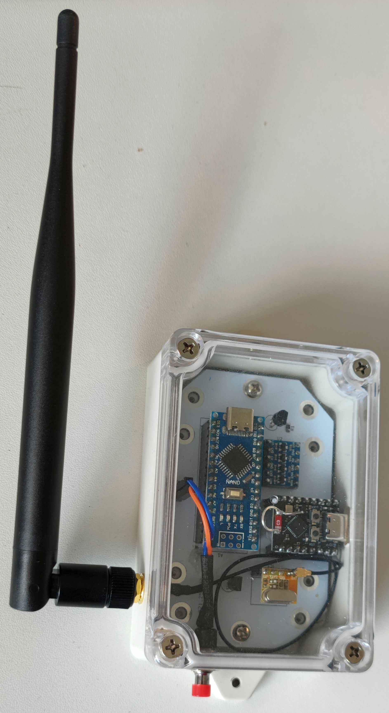
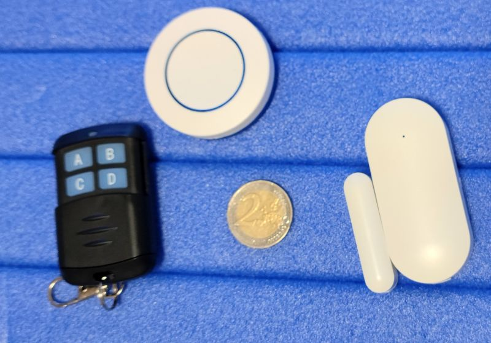

# User Manual: Sensor\_EV1527

## 1. Hardware requirements
* Arduino Nano or similar
* ESP32-C3 or similar
* RBX14 433MHz Module
* 2x Level-Converter 3.3V <-> 5V
* 2x BC547
* 2x Resistor 1k
* Push-Button for System mode
* wire (17.3cm) or solid antenna suited for 433MHz
* sensors based on EV1527

 Note that the entire system will be supplied via the USB port of the ESP32. If you use the USB of the Nano it will not work. Only for flashing the Nano firmware you'll need the USB connector of the Nano.

## 2. Software requirements
* `visual studio code` + `platformIO`

### 2. Compiling and flashing
#### 2.1 Arduino firmware
Connect the Arduino via USB to your computer.
Modify the platformio.ini in the following way:  
    &nbsp;&nbsp;&nbsp;[platformio]  
    &nbsp;&nbsp;&nbsp;default_envs = nano  
    &nbsp;&nbsp;&nbsp;;default_envs = esp32-c3  

Build and upload the code.

#### 2.1 ESP32 firmware
Connect the ESP32 via USB to your computer.
Modify the platformio.ini in the following way:  
    &nbsp;&nbsp;&nbsp;[platformio]  
    &nbsp;&nbsp;&nbsp;;default_envs = nano  
    &nbsp;&nbsp;&nbsp;default_envs = esp32-c3  

Build and upload the code.

Upload config.html and index html:
execute `pio run --target uploadfs`in the platformio temrinal.

### 3. Configuration
#### 3.1 general setup
Note: On first startup a config.json file will be generated in the minifs of the ESP32.

Press the systemMode push button during boot of the ESP32 startup. The ESP will enter the setup mode and provides and Access point. 
This are the WiFi data:  
&nbsp;&nbsp;&nbsp;SSID: EV1527 for homee
&nbsp;&nbsp;&nbsp;Password: 12345678
&nbsp;&nbsp;&nbsp;IP: 192.168.4.1  
&nbsp;&nbsp;&nbsp;SubNet-Mask:  255.255.255.0
Note that the WiFi data for the access point cannot be changed!

After you have been connected to your access point you can connect to the WebInterface via your browser by entering http://192.168.4.1.  
It's recommended to use your PC browser since the WebInterface is not responsive and might be difficult to read on mobile devices.

You can enter now your personal WiFi data, configure the sensor address, ...
Be careful uploading html files and firmware. If your upload invalid files it might corrupt your ESP system and you have to flash it again.

#### 3.2 sensor configuration
You can configure up to 32 sensors.  
You must give a name to each sensor. Only use English letters (e.g. "Tuere" instead of "Türe"). Spaces are ok.  
Each sensor must have a unique homee-ID. Unique means in the entire homee-network.  
Each sensor has a unique address. You can get this address from the section `last received signal`. Let the sensor send its signal(s) and get the address and values from there.

Each sensor can be one of the four types:
1. OpenClose-Sensor
2. OneButton-Remote
3. TwoButton-Remote
4. ThreeButton-Remote
5. FourButton-Remote

For the OpenClose-Sensor you can configure a valaue for Open (Window / Door openes), for Close, for Modification Alarm and for a Battery Low warning. Set the Signal value to -1 if there is no such value available for your sensor model.
If you set a delay, the signal will be removed after the given time in seconds.

For the remote button sensors you have to define the following:  
* Value - the value of the sensor button
* Delay - when shall the system automatically switch back to "off"; -1 if the state shall remain
* Mode: - "Toggle" (usually in combination with delay -1); re-trigger (usually in combination with a delay > 0)  
toggle means that the state will remain until the button is pressed again or until the delay time is over  
re-trigger means that pressing the button will start the delay time again

### Screenshots

assebled PCB:

fully integraged:

used sensors:
)

---

For updates and source code, refer to the [GitHub repository](https://github.com/Oxi75/WindowSensor_EV1527).

